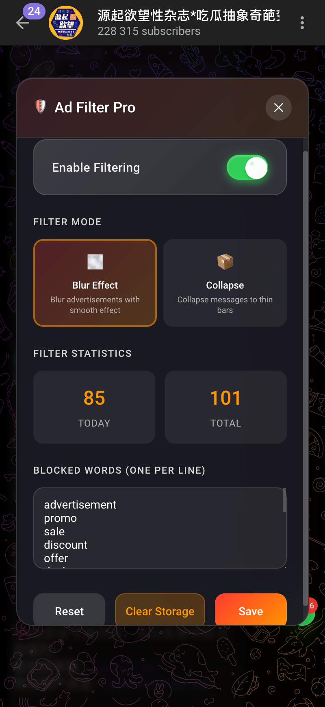

# 🛠️ Telegram Tools Collection

A comprehensive collection of advanced userscripts for Telegram Web to enhance your messaging experience with beautiful Liquid Glass UI design.

## 📦 What's Included

### 🌐 [Telegram Translator Pro](scripts/telegram-translator-pro.user.js)
Advanced real-time translation userscript with beautiful Liquid Glass UI, intelligent caching, and instant language switching.

**Features:**
- 🌊 Liquid Glass UI with iOS-style frosted glass design
- ⚡ Instant language switching with auto-retranslation
- 💾 Smart language-specific caching
- 🎯 Real-time translation with auto-detection
- 📊 Live translation statistics

### 🛡️ [Telegram Ad Filter Pro](scripts/telegram-ad-filter.user.js)
Smart message filtering with multiple visual modes and persistent storage.

**Features:**
- 🌊 Matching Liquid Glass UI design
- 🎯 Multiple filter modes (Blur, Collapse)
- ⚡ Real-time message processing
- 💾 Persistent filtered message storage
- 📊 Live filtering statistics
- 🎨 Beautiful animations and micro-interactions

## 🚀 Installation

### Option 1: Install Individual Scripts
1. Install a userscript manager:
   - [Violentmonkey](https://violentmonkey.github.io/) (Recommended)
   - [Tampermonkey](https://www.tampermonkey.net/)
   - [Greasemonkey](https://www.greasespot.net/)

2. Click on any script file in the `scripts/` folder above
3. Your userscript manager should prompt you to install it

### Option 2: Install All Scripts
1. Install a userscript manager (see above)
2. Install each script individually from the `scripts/` folder
3. Visit [Telegram Web](https://web.telegram.org/k/) and enjoy the enhanced experience

## 🎨 Design Philosophy

All scripts in this collection feature:
- **🌊 Liquid Glass UI**: Beautiful iOS-style frosted glass design
- **⚡ Performance Optimized**: Minimal impact on page performance
- **🎨 Consistent Design**: Matching aesthetics across all tools
- **📱 Responsive**: Works perfectly on different screen sizes
- **🔧 Easy to Use**: Intuitive controls and settings

## 📖 Usage

### Telegram Translator Pro
- Press **Alt+T** to open/close the translator panel
- Click the floating **🌐** button in the bottom-right corner
- Select your target language and enjoy real-time translation

### Telegram Ad Filter Pro
- Press **Alt+F** to open/close the filter panel
- Click the floating **🛡️** button above the translator button
- Toggle filtering on/off and customize blocked words

## 🔧 Compatibility

- ✅ **Telegram Web** (web.telegram.org/k/)
- ✅ **Modern Browsers** (Chrome, Firefox, Safari, Edge)
- ✅ **Mobile Browsers** with userscript support
- ✅ **Multiple Scripts** can be used simultaneously without conflicts

## 🤝 Contributing

Contributions are welcome! Please feel free to submit issues or pull requests.

## 📜 License

MIT License - See [LICENSE](LICENSE) file for details

## 👨‍💻 Author

**sadoi**
- **GitHub**: [github.com/sadoi](https://github.com/sadoi)
- **Project**: [Telegram Tools Collection](https://github.com/sadoi/telegram-tools)

## 🙏 Acknowledgments

- Google Translate API for translation services
- Telegram Web for the awesome platform
- Violentmonkey/Tampermonkey for userscript support
- Liquid Glass UI design inspired by modern iOS aesthetics

---

**Note**: These are community-developed tools and are not officially affiliated with Telegram.