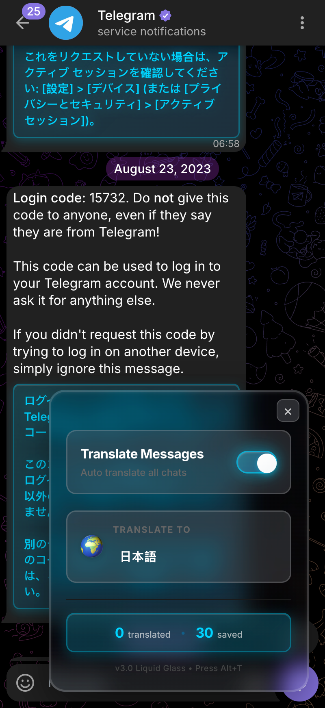

# 🌐 Telegram Translator Pro

Advanced real-time translation userscript for Telegram Web with beautiful Liquid Glass UI, intelligent caching, and instant language switching.



## ✨ Features

- **🌊 Liquid Glass UI**: Beautiful iOS-style frosted glass design with smooth animations
- **⚡ Instant Language Switch**: Automatically retranslates all messages when changing language
- **🎯 Real-time Translation**: Automatically translates messages as they appear
- **💾 Smart Caching**: Dual-layer cache system with language-specific persistence
- **🔍 Auto-detection**: Automatically detects source language
- **🎨 Minimalist Design**: Clean, bold interface that's easy to understand
- **⌨️ Keyboard Shortcuts**: Quick access with Alt+T
- **📊 Live Statistics**: See translated and cached message counts in real-time
- **🚀 Optimized Performance**: Intelligent caching prevents redundant API calls

## 🚀 Installation

1. Install a userscript manager:
   - [Violentmonkey](https://violentmonkey.github.io/) (Recommended)
   - [Tampermonkey](https://www.tampermonkey.net/)
   - [Greasemonkey](https://www.greasespot.net/)

2. Click on the userscript file: `telegram-translator-pro.user.js`

3. Your userscript manager should prompt you to install it

4. Visit [Telegram Web](https://web.telegram.org/k/) and the translator will activate automatically

## 📖 Usage

### Opening the Control Panel

- Click the floating **🌐** button in the bottom-right corner
- Or press **Alt+T** on your keyboard

### Quick Start

1. **Toggle Translation**: Click the big toggle switch to enable/disable translation
2. **Choose Language**: Select your target language from the dropdown (🌍)
3. **That's it!**: Messages will be automatically translated as they appear

### Settings

The interface is intentionally minimal with only essential controls:

| Control | Description |
|---------|-------------|
| **Main Toggle** | Turn translation on/off for all messages |
| **Target Language** | Choose which language to translate into |
| **Statistics** | View translated and saved (cached) message counts |

**Note**: Source language is automatically detected, and same-language messages are automatically skipped for optimal performance.

### Keyboard Shortcuts

- **Alt+T**: Toggle translator panel
- **Esc**: Close panel

### Auto-Refresh on Language Change

When you change the target language, all visible messages are **automatically retranslated** to the new language instantly!

## 🌍 Supported Languages

Arabic, Chinese (Simplified/Traditional), Czech, Dutch, English, Finnish, French, German, Greek, Hebrew, Hindi, Indonesian, Italian, Japanese, Korean, Persian, Polish, Portuguese, Romanian, Russian, Spanish, Swedish, Thai, Turkish, Ukrainian, Vietnamese, and more.

## 🔧 Configuration

The script stores settings in `localStorage`:
- `tg_enabled`: Translation enabled state
- `tg_target_lang`: Target language code (user-selectable)
- `tg_source_lang`: Always set to "auto" (auto-detection)
- `tg_skip_same_lang`: Always enabled (auto-skip same language)
- `tg_translation_cache`: Persistent cache with format `messageId:targetLang` for language-specific caching

## 🐛 Troubleshooting

### Translations not appearing?

1. Open browser console (F12) - Debug mode is enabled by default
2. Check for error messages with `[Translator]` prefix
3. Make sure translation is enabled (toggle switch is on)
4. Try disabling and re-enabling the toggle

### Language change not working?

- The script automatically retranslates all messages when you change language
- If translations don't update, try toggling translation off and on again
- Check browser console for any errors

### Script not loading?

1. Make sure your userscript manager is enabled
2. Check that you're on `https://web.telegram.org/k/*`
3. Refresh the page
4. Check browser console for errors

## 🏗️ Technical Details

### Architecture

- **Liquid Glass UI**: CSS backdrop-filter with 20px blur and translucent backgrounds for frosted glass effect
- **Message Detection**: Uses multiple selectors to find Telegram message containers
- **ID System**: Leverages Telegram's `data-mid` attributes for persistent caching
- **Language-Specific Cache**: Cache keys include target language (`messageId:targetLang`) for multi-language support
- **Translation Engine**: Google Translate API via `GM_xmlhttpRequest`
- **Request Queue**: Manages concurrent API requests (max 3 simultaneous)
- **Mutation Observer**: Detects new messages in real-time
- **Auto-Refresh**: Automatically retranslates all messages when language changes

### Performance Features

- LRU cache with configurable size limit (1000 entries)
- Request debouncing (200ms)
- Concurrent request limiting
- Retry mechanism with exponential backoff
- Text validation to skip dates, URLs, and numbers

### Configuration Constants

```javascript
CONFIG = {
  maxCacheSize: 1000,
  maxConcurrentRequests: 3,
  requestTimeout: 10000,
  retryAttempts: 2,
  retryDelay: 1000,
  debounceDelay: 200,
  minTextLength: 3,
  initialScanDelay: 3000,
  scrollDebounceDelay: 150,
  intersectionThreshold: 0.1
}
```

## 📊 Statistics

The panel displays real-time statistics in a compact inline format:
- **Translated**: Total number of messages translated in current session
- **Saved**: Total number of translations cached in localStorage (across all languages)

## 🤝 Contributing

Contributions are welcome! Please feel free to submit issues or pull requests.

## 📜 License

MIT License - See [LICENSE](LICENSE) file for details

## 👨‍💻 Author

**sadoi**

## 🙏 Acknowledgments

- Google Translate API for translation services
- Telegram Web for the awesome platform
- Violentmonkey/Tampermonkey for userscript support

## 📝 Changelog

### Version 3.0 - Liquid Glass (Current)
- 🌊 Complete redesign with beautiful Liquid Glass UI (iOS-style frosted glass effect)
- ⚡ Instant language switching - automatically retranslates all messages when language changes
- 💾 Language-specific persistent cache (`messageId:targetLang` format)
- 🎨 Minimalist interface with only essential controls
- 📊 Compact inline statistics display
- 🔧 Auto-enabled features: source language detection, skip same language
- 🎯 Removed unnecessary features for cleaner UX
- 🚀 Optimized blur (20px) for better clarity and performance
- ✨ Brighter cyan color scheme (#00d4ff) for better visibility

### Version 2.0 - iOS Glass Style
- Complete UI redesign with modern dark gradient theme
- Improved animations and transitions
- Enhanced visual hierarchy

### Version 1.4
- Fixed Telegram Web K structure detection
- Improved data-mid caching system
- Enhanced virtual scrolling support
- Better message ID tracking
- Optimized performance

---

**Note**: This is a community-developed tool and is not officially affiliated with Telegram.
